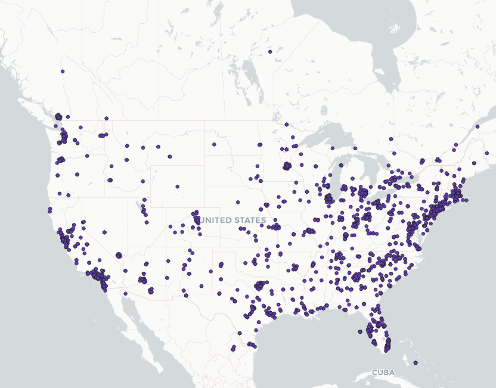
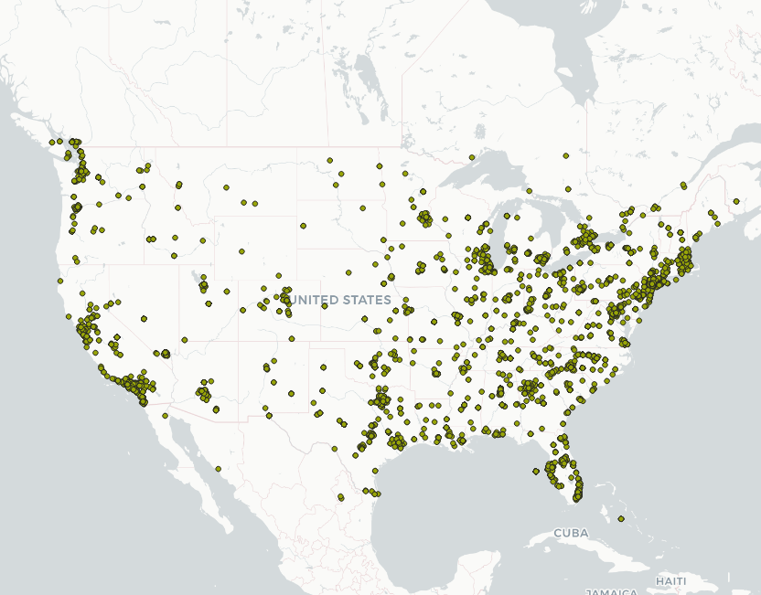
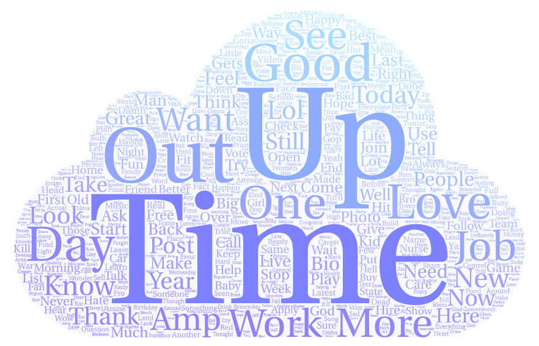
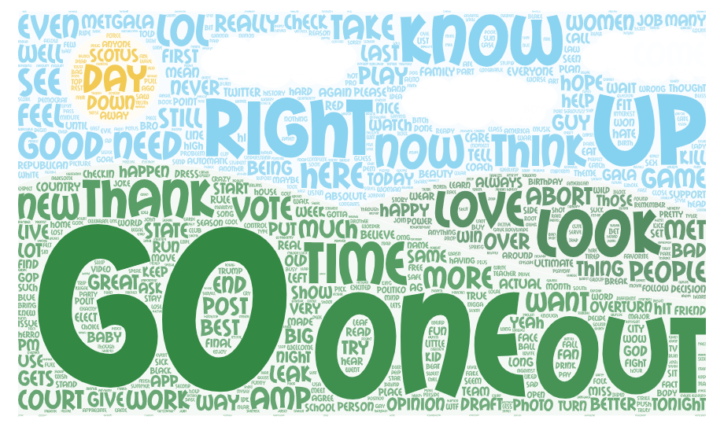

#Introduction
introduce your comparison of two places or two time periods. Why do you want to make this comparison? Make sure this narrative will be stored in a readme.md. (POINT 15)

#Map Comparision

export the two maps to the repository and then insert them to the readme.md. Please compare them and briefly discuss why they represent different geospatial patterns on the map. (POINT 15)

  

<b>map 1</b>

 

<b>map 2</b>

#Wordcloud Comparision

export the two word clouds to the repository and then insert them to the readme.md. Please compare them and briefly discuss why they represent different context. (POINT 15)

<b>Wordcloud 1</b>

 

<b>Wordcloud 2</b>

